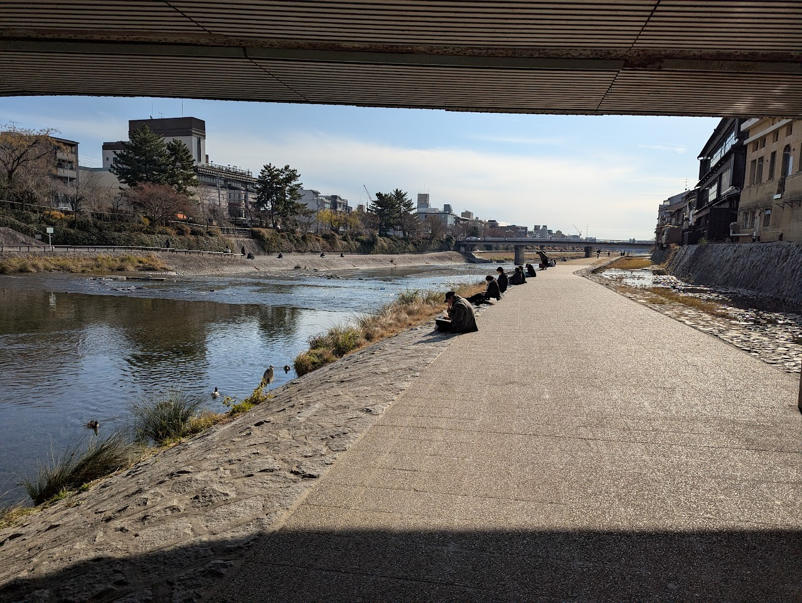

四条の方に買い物に出た。松屋に入ってネギ塩ものを頼んだら死ぬほど塩辛くてびっくりしてしまった。若干気分を落としながら四条に行ってグローバルワークでセーターを見るつもりだったんだけど、なんかいいように思う色がなくてやめてしまった。鴨川沿いを散歩してヨドバシに行って、ランニングシューズと寝間着を買った。あとは食料品の買い物。買い物が終わったあとにゲームをして、自分の体調がそこまで良くなっていないことに気づいたりした。バカっぽい。

